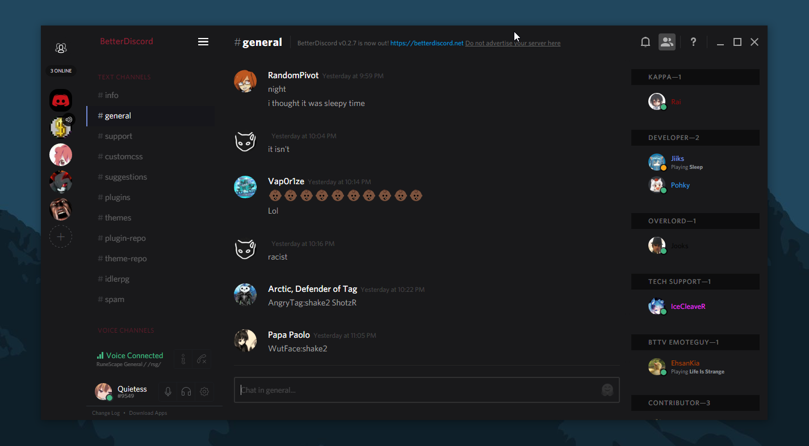

# Casual-Dark: BetterDiscord theme

I don't recommend using my CSS as a way to learn. It's very disorganized, out of order, and very little comments.

 

Requirements:

[BetterDiscord](https://betterdiscord.net/)

[BetterDiscord+](https://github.com/Bluscream/BetterDiscord-Plugins-and-Themes)

1. Add to C:\Users\NAME\AppData\Roaming\BetterDiscord\themes
2. Press CTRL+R to reload BetterDiscord
3. Enable in BetterDiscord > Themes in settings.
