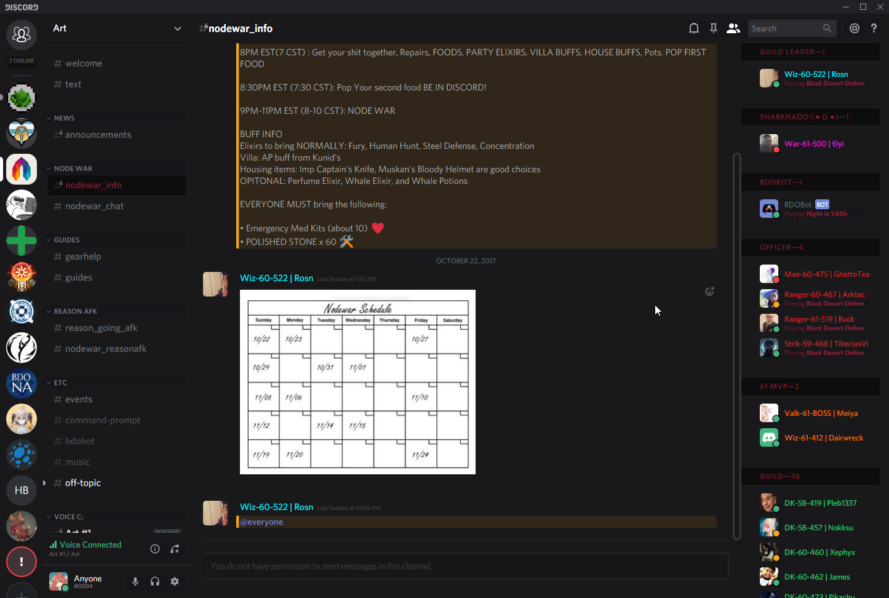

# This theme is no longer being updated, I'm leaving it up in case someone else wants to download the code and work on it yourself. Feel free to release it under your own name once you've fixed it, just throw me a shout out or something, thanks.

# Casual-Dark: BetterDiscord theme

I don't recommend using my CSS as a way to learn. It's very disorganized, out of order, and very little comments. I'll work on it in the future.

 

Requirements:

[BetterDiscord](https://betterdiscord.net/)

1. Add only "Casual_Dark.theme.css" to C:\Users\NAME\AppData\Roaming\BetterDiscord\themes
2. Press CTRL+R to reload BetterDiscord
3. Enable "Casual_Dark.theme.css" in BetterDiscord > Themes in settings.

If you want the icon that shows up next to the server icons when there's new messages on that server:

1. CTRL+F
2. .guilds li .guild-inner:before {
3. Remove the line that says
4. display:none;
